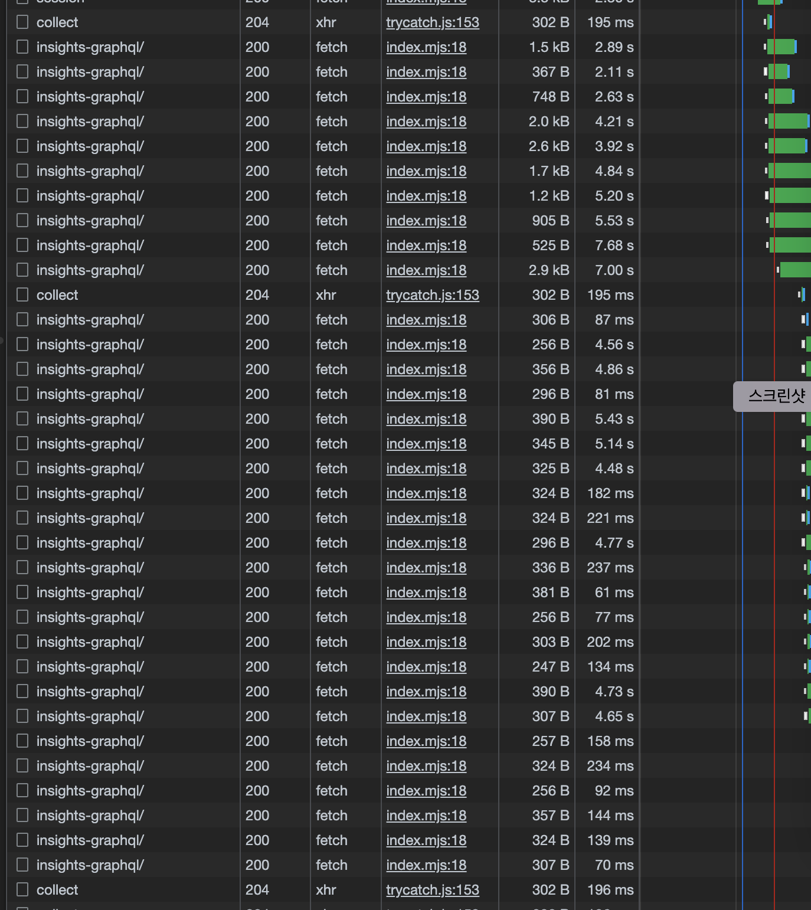
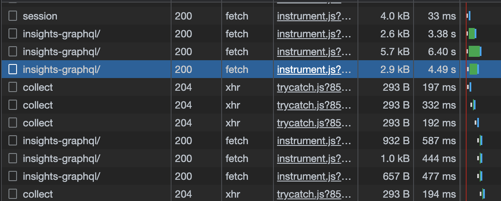
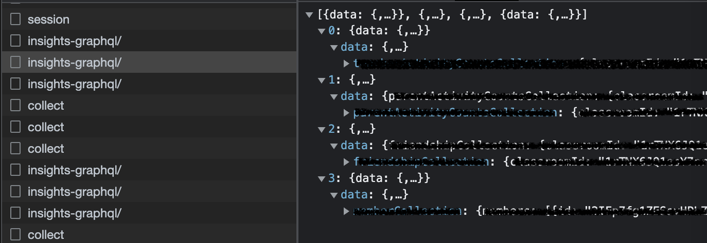

## 다수의 API 호출

서버에서 API를 호출하여 데이터를 바탕으로 화면을 구성하게 될 때, 다수의 호출을 연속적으로 보내야 하는 경우가 많습니다.
현재 주로 사용하고 있는 GraphQL을 예로 들어보자면

서점에서 보유중인 책들의 정보를 반환하는 GraphQL API를 통해 `책의 제목` `출판일` `작가 이름` 을 포함하는 책들의 정보를 리스트 형식으로 화면에 표현하고자 합니다. 이 때, 책과 관련 정보를 구성하는 모델은 다음과 같을 수 있습니다.

```graphq
BookDto {
  bookName: String!
  description: String
  publishedAt: String!
  AurthorId: String!
}

AuthorDto {
  id: String!
  name: String!
  gender: String!
}
```

위와 같은 경우, 1차적으로 책들의 리스트를 호출하고 개별 책의 데이터에 포함되어 있는 저자 ID를 통해 저자의 정보를 2차적으로 불러와야 합니다. 저자의 정보에 대한 query가 n+1 개가 되게 되는것입니다.

많은 서버 요청은 서버에 부하를 줄 수 있으며, 이는 성능 저하를 유발할 수 있고 또한 당연하게도 비용이 증가될 수 있습니다.

## Apollo Client Batch Request

React 생태계에서 GraphQL API를 위해 가장 많이 사용되는 라이브러리는 Apollo Client인데 (의견에 따라 다를 수 있습니다.), Apollo Client에서 위 문제를 해결해줄 수 있는 간단한 인터페이스를 제공해 줍니다.

[ApolloClient Batch HTTP Link](https://www.apollographql.com/docs/react/api/link/apollo-link-batch-http/)

```ts
// import { createHttpLink } from "@apollo/client";
import { BatchHttpLink } from '@apollo/client/link/batch-http';

const link = new BatchHttpLink({
  uri: 'http://localhost:4000/graphql',
  batchMax: 5, // 최대로 batch되는 요청 수 default: 5
  batchInterval: 20, // ms단위로, batchMax가 충족되지 않아도 해당 interval time에 다다르면 요청이 전송 됨 default: 5
});
```

기존처럼 HttPLink를 만들어 주는 method인 `createHttpLink` method 대신 문서에서 설명하고 있는 class를 호출하여 인스턴스를 생성하게 됩니다.

아래는 하나의 페이지에서 batch 요청을 적용하기 이전의 query 호출 입니다. 하나의 페이지를 구성하기 위해 여러번의 요청이 서버로 전달되고, 응답이 돌아오게 됩니다.


batch request를 적용하면 아래와 같이 요청이 줄어들게 됩니다.


그렇다면 응답은 어떻게 확인할 수 있을까요?
하나의 요청에 여러개의 요청이 (위 설정 대로라면 최대 5개의 요청) 배열구조의 형태로 전달받게 됩니다.


## 적용 시 주의 할 점

마냥 좋기만 한것은 아닙니다. 위에서 설명한것 처럼 절대적인 서버와의 통신 횟수를 줄여주어 비용 절감과 서버 부하를 줄일 수가 있습니다. 하지만 trade off로 하나의 batch request로 묶이게 된 개별 요청들은, 내부의 모든 응답이 처리 되어야만 클라이언트로 반환될 수가 있습니다. 따라서 5개중 4개의 요청시간이 짧은 요청과, 1개의 요청시간이 긴 요청이 있다면 마지막 응답시간에 따라 모든 5개의 요청의 응답시간이 늘어나는 것 입니다.

또한 개별 요청별로 확인이 힘들기 때문에 디버깅에 애를 먹었던 경험이 있습니다.

Batch 요청은 클라이언트에서 하고싶다고 할 수 있는것은 아니고, API를 제공해 주고 있는 서버에서 허용해 주어야 합니다.
서버 기술에 따라서 직접 Batch request를 처리하는 로직을 구현해야 할 수도 있고, 서버 라이브러리에서 처리해줄 수 있는데,
저의 경우 GraphQL Mesh와 Yoga로 구현된 BFF 서버를 사용하고 있어서 yoga에서 단순 설정만으로 Batch 요청을 허용해 줄 수 있었습니다. Apollo Server도 동일하니 공식 문서를 확인해 봐야 할것 같습니다.

```toc

```
